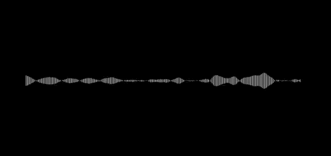

# MicViz
A simple real time audio visualisation app build in Rust.  
This is just a small and simple thing implemented with [(rust) portaudio](https://github.com/RustAudio/rust-portaudio) and [three(-rs)](https://github.com/three-rs/three/issues).  



## Getting started
### Environment setup
You should be able to compile this project for any OS. For now this docs will focus on how to setup the enviroment on MacOS. 

To setup the environment run the following commands (not everything may apply to you): 
```bash
# Clone this repository
git clone https://github.com/maniflames/MicViz.git

# Install Rust with homebrew
brew install rust

# Install portaudio with homebrew
brew install portaudio

# Unpack MacOS SDK headers 
open /Library/Developer/CommandLineTools/Packages/macOS_SDK_headers_for_macOS_10.14.pkg

```

### Compile and Run
Now that you're all set you can run this:

```bash
# Navigate to project
cd MicViz

# Compile and run with cargo
cargo run
```

Enjoy 😁